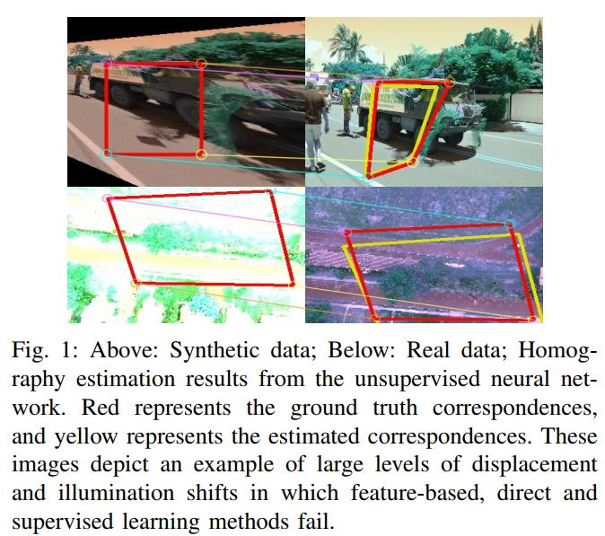
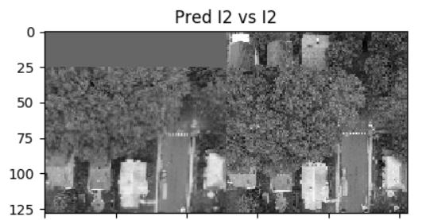

#  Unsupervised Deep Homography: A Fast and Robust Homography Estimation Model 
[This paper](https://arxiv.org/abs/1709.03966) will be presented in International Conference on Robotics and Automation (ICRA) 2018 (Brisbane, Australia) and appear in proceedings of IEEE Robotics and Automation Letters.

We devise an unsupervised learning algorithm that trains a Deep Convolutional Neural Network to estimate planar homographies. We compare the proposed algorithm to traditional feature-based and direct methods, as well as a corresponding supervised learning algorithm. Our empirical results demonstrate that compared to traditional approaches, the unsupervised algorithm achieves faster inference speed, while maintaining comparable or better accuracy and robustness to illumination variation. In addition, on both a synthetic dataset and representative real-world aerial dataset, our unsupervised method has superior adaptability and performance compared to the supervised deep learning method.

<!--  -->
<p align="center">
  
</p>

## Citation
If you use this code for research please cite:
   
    @InProceedings{nguyen2017unsupervised,
      title={Unsupervised Deep Homography: A Fast and Robust Homography Estimation Model},
      author={Nguyen, Ty and Chen, Steven W and Shivakumar, Shreyas S and Taylor, Camillo J and Kumar, Vijay},
      booktitle={RA-L},
      pages={},
      year={2018},
      organization={IEEE}
      month        = " ",
      year         = "2018",
      url          = "https://arxiv.org/abs/1709.03966"
    }

 
## Installation  
Building and using requires the following libraries and programs\
    cuda 8.0.61 (required for gpu support) \
    python 2.7.12 \
    tensorflow 1.2.1 (or higher)\
    opencv 3.4.0 (can be installed using: pip install opencv-python )\

We built our system on ubuntu 16.04. Tensorflow (CPU) and Tensorflow (GPU) can both work well; they are installed in virtualenv. Other methods to install tensorflow have not been tested. 
 

Install required python packages (pip is required)
```bash 
source virtualenv_name/bin/activate 
pip install -r requirements.txt 
```  

## Build instructions
### Clone repo 
```bash
git clone https://github.com/tynguyen/unsupervisedDeepHomographyRAL2018.git
```

## Trained Models 
### Model trained on Synthetic Data
Download at 
```bash 
https://drive.google.com/drive/folders/1Y9oNgbJTrAdkgf5-T1xONtU9n2ZqwDta?usp=sharing
```
Then, store the synthetic_models to folder models 

### Model trained on Aerial Image Data
```bash 
https://drive.google.com/drive/folders/16RI7R0EVayiXfYoP2Ahhl4yN2sWhG76Z?usp=sharing
```
Note: you need to format your image data in a correct size in order to make use of this trained model. Please refer to the next sections to get how to format the raw images 


## Preparing training dataset (synthetic)
#### Download MS-COCO dataset http://cocodataset.org/#download
We use 2014/Train to generate training data and 2014/Testing to generate test set. 
Store them into RAW_DATA_PATH and TEST_RAW_DATA_PATH which are repositories declared in generating synthetic data.  

### Generate synthetic dataset
In the file code/utils/gen_synthetic_data.py, set important parameters as follows
```bash
  RHO = 45 # The maximum value of pertubation. The higher it is, the larger displacement between 
  # two generated images is. 

  DATA_NUMBER = 100000  # number of pair of synthetic images in training dataset 
  TEST_DATA_NUMBER = 5000 # number of pair of synthetic images in test dataset

  IM_PER_REAL = 2 # Generate 2 different synthetic images from one single real image

  # Size of synthetic image
  HEIGHT = 240  
  WIDTH = 320
  # Size of crop 
  PATCH_SIZE = 128

  # Directories to MS-COCO images 
  RAW_DATA_PATH = "/Earthbyte/tynguyen/rawdata/train/" # Real images used for generating synthetic data
  TEST_RAW_DATA_PATH = "/Earthbyte/tynguyen/rawdata/test/" # Real images used for generating test synthetic data

  # Synthetic data directories
  DATA_PATH = "/home/tynguyen/pose_estimation/data/synthetic/" + str(RHO) + '/'

  I_DIR = DATA_PATH + 'I/' # First large image in one pair 
  I_PRIME_DIR = DATA_PATH + 'I_prime/' # Second large image in one pair 

  # Since all generated images will be stored at the same location, we need .txt files to 
  # maintain training images and test images 
  FILENAMES_FILE = os.path.join(DATA_PATH,'train_synthetic.txt') # List of training images 
  TEST_FILENAMES_FILE = os.path.join(DATA_PATH,'test_synthetic.txt') # List of test images 

  GROUND_TRUTH_FILE = os.path.join(DATA_PATH,'gt.txt') # (In training set): ground truth of homography parameters (delta movement of 4 corners)
  PTS1_FILE = os.path.join(DATA_PATH,'pts1.txt') # (in training set): path to 4 corners on the first image 

  TEST_PTS1_FILE = os.path.join(DATA_PATH,'test_pts1.txt') # Test set: ground truth of homography parameters (delta movement of 4 corners)
  TEST_GROUND_TRUTH_FILE = os.path.join(DATA_PATH,'test_gt.txt') # Test: path to 4 corners on the first image 

```
### Generate training dataset
It will take a few hours to generate 100.000 data samples. You can choose a smaller number of data for debugging. 
```bash
python utils/gen_synthetic_data.py --mode train --num_data [number of data] 
```

### Generate test dataset
```bash 
python utils/gen_synthetic_data.py --mode test 
```

## Debugging 
In all training and testing processes, you can visualize images using either Tensorboard or just set --visual True in calling python functions. Tensorboard is highly recommended since it does not reduce the running speed as much as plotting using --visual flag. 
For example
```bash 
python homography_CNN_synthetic.py --mode train --lr 5e-4 --loss_type h_loss --visual True 
``` 

## Train model with synthetic dataset
In the file code/homography_CNN_synthetic.py, set important parameters as follows
```bash
  # Size of synthetic image and the pertubation range (RH0)
  HEIGHT = 240 #
  WIDTH = 320
  RHO = 45 # The maximum value of pertubation. The higher it is, the larger displacement between 
  # two generated images is. Change this value to evaluate different levels of displacements 
  PATCH_SIZE = 128

  # Synthetic data directories
  DATA_PATH = "/home/tynguyen/pose_estimation/data/synthetic/" + str(RHO) + '/'

  I_DIR = DATA_PATH + 'I/' # First large image in one pair 
  I_PRIME_DIR = DATA_PATH + 'I_prime/' # Second large image in one pair 

  # Since all generated images will be stored at the same location, we need .txt files to 
  # maintain training images and test images 
  FILENAMES_FILE = os.path.join(DATA_PATH,'train_synthetic.txt') # List of training images 
  TEST_FILENAMES_FILE = os.path.join(DATA_PATH,'test_synthetic.txt') # List of test images 

  GROUND_TRUTH_FILE = os.path.join(DATA_PATH,'gt.txt') # (In training set): ground truth of homography parameters (delta movement of 4 corners)
  PTS1_FILE = os.path.join(DATA_PATH,'pts1.txt') # (in training set): path to 4 corners on the first image 

  TEST_PTS1_FILE = os.path.join(DATA_PATH,'test_pts1.txt') # Test set: ground truth of homography parameters (delta movement of 4 corners)
  TEST_GROUND_TRUTH_FILE = os.path.join(DATA_PATH,'test_gt.txt') # Test: path to 4 corners on the first image 

  # Log and model directories
  MAIN_LOG_PATH = '/media/tynguyen/'
  LOG_DIR       = MAIN_LOG_PATH + "docker_folder/pose_estimation/logs/"
  MODEL_DIR     = MAIN_LOG_PATH + "docker_folder/pose_estimation/models/"

  # Where to save visualization images (for report)
  RESULTS_DIR   = MAIN_LOG_PATH + "docker_folder/pose_estimation/results/synthetic/report/"

  # List of augmentations to the data.
  AUGMENT_LIST = ['normalize'] # 'normalize': standardize images

```

### Supervised
```bash 
python homography_CNN_synthetic.py --mode train --lr 5e-4 --loss_type h_loss
``` 
### Unsupervised
```bash 
python homography_CNN_synthetic.py --mode train --lr 1e-4 --loss_type l1_loss 
``` 

## Test model with synthetic dataset
### Supervised
```bash 
python homography_CNN_synthetic.py --mode test --lr 5e-4 --loss_type h_loss 
``` 

### Unsupervised
```bash 
python homography_CNN_synthetic.py --mode test --lr 1e-4 --loss_type l1_loss  
``` 

# Generate aerial dataset
Due to the company's privacy, we cannot make our aerial dataset publically available. However, there is an alternative which readers might be interested in, from: 
https://github.com/OpenDroneMap/OpenDroneMap/tree/master/tests/test_data

These datasets are quite similar to ours. 


### Supervised 
For the supervised method, everything should be as same as in synthetic dataset. We use aerial images to generate synthetic images to train the model. 

### Unsupervised 
In our aerial dataset, images are recorded in time sequence. Thus, we consider two consecutive images as a pair and generate some new pair of training samples (by randomly cropping). Each training sample consists of: a pair of (HEIGHT x WIDTH) images and a pair of corresponding crops. 

As mentioned in the paper, from these original pair of images, we first resize from (FULL_HEIGHT x FULL_WIDTH) to (HEIGHT x WIDTH) then crop each pair of resized images at the same location (y,x). From each pair of original images, we generate IM_PER_REAL training samples by keeping y constant and romdomizing x (with max pertubation = RHO).

It is recommended that the resizing and cropping are highly dependent on the level of displacement between a pair of original images. Our aerial dataset features a large displacement so we have to keep y constant and make a large crop (PATCH_SIZE/WIDTH). However, there are still border effect during the warping: the warped crop of the second image has a black area near its edge. 
For a better performance, ones can think of moving the crop window to the largest overlapping areas in the images other than just center-cropping.  
<p align="center">
  
</p>

```bash
   RHO = 24 # Maximum range of pertubation
   DATA_NUMBER = 10000
   TEST_DATA_NUMBER = 1000
   IM_PER_REAL = 20 # Generate 20 different pairs of images from one single real image

   # Size of synthetic image
   HEIGHT = 142 #
   WIDTH = 190
   PATCH_SIZE = 128

   FULL_HEIGHT = 480 #
   FULL_WIDTH  =  640
   # Directories to files
   RAW_DATA_PATH = "/Earthbyte/tynguyen/real_rawdata/joe_data/train/" # Real images used for generating real dataset
   TEST_RAW_DATA_PATH = "/Earthbyte/tynguyen/real_rawdata/joe_data/test/" # Real images used for generating real test dataset

   # Data directories
   DATA_PATH = "/Earthbyte/tynguyen/docker_folder/pose_estimation/data/synthetic/" + str(RHO) + '/'

   I_DIR = DATA_PATH + 'I/' # Large image 240 x 320
   I_PRIME_DIR = DATA_PATH + 'I_prime/' # Large image 240 x 320

   FULL_I_DIR = DATA_PATH + 'FULL_I/' # Full image size 480 x 640
   FULL_I_PRIME_DIR = DATA_PATH + 'FULL_I_prime/' # Full image size 480 x 640

   PTS1_FILE = os.path.join(DATA_PATH,'pts1.txt')
   FILENAMES_FILE = os.path.join(DATA_PATH,'train_real.txt')
   GROUND_TRUTH_FILE = os.path.join(DATA_PATH,'gt.txt')
   TEST_PTS1_FILE = os.path.join(DATA_PATH,'test_pts1.txt')
   TEST_FILENAMES_FILE = os.path.join(DATA_PATH,'test_real.txt')
   # In real dataset, ground truth file consists of correspondences
   # Each row in the file contains 8 numbers:[corr1, corr2]
   TEST_GROUND_TRUTH_FILE = os.path.join(DATA_PATH,'test_gt.txt')

```

```bash
python utils/gen_real_data.py --mode train --num_data [number of training data] 
```
```bash
python utils/gen_real_data.py --mode test --num_data [number of test data] 
```

## Train model with aerial dataset
In the file homography_CNN_real.py, set parameters as follows 
```bash
   # Size of synthetic image and the pertubation range (RH0)
   HEIGHT = 142 #
   WIDTH = 190
   RHO = 24
   PATCH_SIZE = 128
   # Full image size (used for displaying)
   FULL_HEIGHT = 240 #
   FULL_WIDTH =  320

   # Data directories
   DATA_PATH = "/home/tynguyen/pose_estimation/data/real/" + str(RHO) + '/'

   I_DIR = DATA_PATH + 'I/' # Large image
   I_PRIME_DIR = DATA_PATH + 'I_prime/' # Large image
   PTS1_FILE = os.path.join(DATA_PATH,'pts1.txt')
   FILENAMES_FILE = os.path.join(DATA_PATH,'train_real.txt')
   GROUND_TRUTH_FILE = None # There is no ground truth during training 

   FULL_I_DIR = DATA_PATH + 'FULL_I/' # Large image
   FULL_I_PRIME_DIR = DATA_PATH + 'FULL_I_prime/' # Large image
   TEST_PTS1_FILE = os.path.join(DATA_PATH,'test_pts1.txt')
   TEST_FILENAMES_FILE = os.path.join(DATA_PATH,'test_real.txt')
   # Correspondences in test set
   TEST_GROUND_TRUTH_FILE = os.path.join(DATA_PATH,'test_gt.txt')

   # Log and model directories
   MAIN_LOG_PATH = '/media/tynguyen/DATA/'
   LOG_DIR       = MAIN_LOG_PATH + "docker_folder/pose_estimation/logs/"

   # Where to load model. This could be the location of the model trained on synthetic data
   # or any other dataset
   LOAD_MODEL_DIR = MAIN_LOG_PATH + "docker_folder/pose_estimation/models/"
   # Where to save new model. This is the location of the fine-tuned model
   SAVE_MODEL_DIR = MAIN_LOG_PATH + "docker_folder/pose_estimation/models/real_models/"

   # Where to save visualization images (for report)
   RESULTS_DIR   = MAIN_LOG_PATH + "docker_folder/pose_estimation/results/synthetic/report/"

   # list of augmentations to the data
   AUGMENT_LIST = ['normalize']

```
### Supervised
For supervised method, after generating a new set of synthetic images using the aerial dataset, 
change DATA_PATH in homography_CNN_synthetic.py accordingly and run 
```bash 
python homography_CNN_synthetic.py --mode train --lr 5e-4 --loss_type h_loss 
``` 

### Unsupervised
```bash 
python homography_CNN_real.py --mode train --lr 1e-4 --loss_type l1_loss 
``` 
There are a couple of options during the training. 
#### Training model from scratch 
```bash 
python homography_CNN_real.py --mode train --lr 1e-4 --loss_type l1_loss --finetune False
``` 
#### Finetune model (after training on synthetic dataset or other datasets) 
```bash 
python homography_CNN_real.py --mode train --lr 1e-4 --loss_type l1_loss --finetune True
``` 
#### Resume training the model (after training on aerial dataset for a while) 
```bash 
python homography_CNN_real.py --mode train --lr 1e-4 --loss_type l1_loss --resume True
``` 
#### Resume training the model (after training on aerial dataset for a while) but reset iteration number
```bash 
python homography_CNN_real.py --mode train --lr 1e-4 --loss_type l1_loss --resume True --retrain True 
``` 

